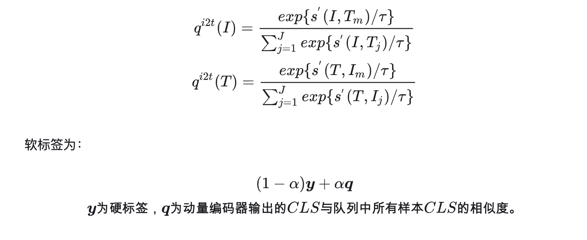

# Preschool VQA task
## VLP相关模型
### VILT
    text_encoder : bert
    img_encoder : vit
    轻量级模型舍弃重度视觉特征提取器（目标检测）
    infer快，train难度大，参数量(including vqa head)117M

### BLIP
    encoder-decoder模型，可做generate任务，同样vit作为IE
    参数量385M

------
*3.18 update*

### ALBEF
    1. 先align再fusion
    2. loss:itc(infoNCE),itm(二分类),mlm
    3. hard negtive sampling 难负采样，在itm时负样本过于简单对模型提升不大，通过itc生成的相似度，选取相似度最大的负样本。
    4.momentum encoder，（与Moco相似），自学习方法，维护一个固定长度的queen，新样本入队旧样本出队。(itc用队列里其他样本作为soft label，mlm蒸馏momentum model，KL散度替换CE loss)

### BLIP2
    1. 冻结Image Encoder和LLM，训练QFormer，learned query作为对其的桥梁
    2. 充分利用已有的图像和文本模型的weight，训练参数小
    3. vqa任务自带问题（用于挖掘图像语义，与learned query作用相似），因此要将question输入到QF的query部分
    4. 两步训练过程，第一步表示学习训练Qformer，第二步生成式预训练，训练与LLM的对齐能力
    5. 实验设置LLM为T5等，单纯的vqa任务可以考虑去掉或替换为较小的语言模型？

## 数据
    考虑先用VQA V2训练模型理解能力，再用PreSchoolVQA的数据做finetune?

    
